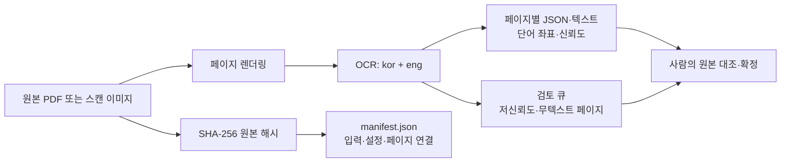
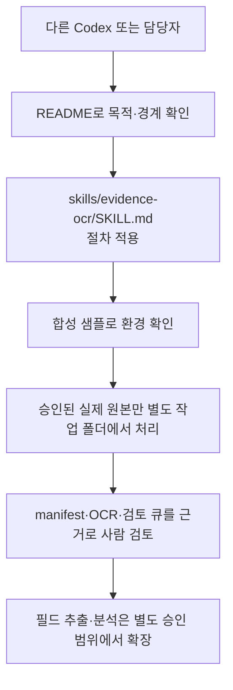

# Evidence OCR

> PDF와 스캔 기록을 **검토 가능한 증거 데이터**로 전환하는 재사용형 OCR 워크플로입니다.

## 경영 요약

현장·검사 기록이 종이 또는 스캔본으로만 남으면, 필요한 사실을 다시 찾고 확인하는 데 시간이 들며 이후 분석에도 바로 쓰기 어렵습니다. Evidence OCR은 원본을 바꾸지 않은 채 페이지별 OCR 결과, 신뢰도 신호, 검토 대상 목록, 원본 해시를 함께 남기는 최소 구조입니다.

이 프로젝트의 목적은 OCR 결과를 곧바로 품질 판정으로 쓰는 것이 아닙니다. 사람이 원본과 대조하여 판단할 수 있도록 **찾기 쉽고, 검토 가능하며, 출처가 남는 자료**를 만드는 데 있습니다.

| 관점 | V0.1이 제공하는 것 | 제공하지 않는 것 |
|---|---|---|
| 기록 보존 | 원본별 SHA-256과 페이지별 산출물 연결 | 원본의 수정·대체 |
| 검토 효율 | 텍스트·좌표·신뢰도 기반의 검토 우선순위 | OCR만으로 사실 확정 |
| 데이터화 기반 | 향후 필드 추출·추세 분석으로 확장 가능한 구조 | 규격·합격·부적합 자동 판정 |

## 처리 구조



### 한 건이 남기는 증거

1. 원본 파일의 SHA-256
2. 페이지 이미지
3. 페이지별 OCR JSON과 텍스트
4. 신뢰도가 낮거나 텍스트가 없는 페이지의 검토 큐
5. 입력 파일·OCR 언어·DPI·페이지 산출물을 연결하는 manifest

## 현재 V0.1 범위

- PDF 또는 이미지 1건을 페이지 이미지로 변환
- `kor+eng` OCR 수행
- 페이지별 JSON·텍스트·단어 위치·신뢰도 생성
- `OCR_NO_TEXT`, `OCR_REVIEW_REQUIRED`, `OCR_READY_FOR_REVIEW`으로 검토 우선순위 분리
- 원본 SHA-256과 처리 설정을 `manifest.json`으로 기록

### 검토 상태의 의미

| 상태 | 의미 | 필요한 다음 조치 |
|---|---|---|
| `OCR_NO_TEXT` | OCR 텍스트가 없음 | 원본 페이지·해상도·언어 설정 확인 |
| `OCR_REVIEW_REQUIRED` | 텍스트는 있으나 신뢰도 기준 미달 | 원본과 대조하여 사람이 확인 |
| `OCR_READY_FOR_REVIEW` | 검토 시작에 필요한 OCR 신호 확보 | 원본 대조 후 필요한 값만 확정 |

`OCR_READY_FOR_REVIEW`은 **자동 승인 또는 품질 판정**을 뜻하지 않습니다.

## 저장소 구성

```text
codex-evidence-ocr/
├─ README.md                         # 목적, 범위, 실행 방법
├─ AGENTS.md                         # 작업·보안 경계
├─ MEMORY.md                         # 장기 유지 결정
├─ HANDOFF.md                        # 현재 상태와 다음 시작점
├─ requirements.txt                  # Python 의존성
├─ samples/
│  └─ synthetic/
│     ├─ README.md                   # 합성 샘플 설명
│     └─ generate_sample.py          # 실제 자료 없는 OCR 시험 이미지 생성기
├─ skills/
│  └─ evidence-ocr/
│     ├─ SKILL.md                    # 다른 Codex가 따를 실행 절차
│     ├─ agents/openai.yaml          # Codex UI 표시 정보
│     ├─ references/output-contract.md # 출력 필드·검토 계약
│     └─ scripts/process_document.py # PDF·이미지 증거 OCR 처리기
└─ tests/
   └─ test_process_document.py       # OCR 분류 규칙 단위시험
```

### 재사용 구조



## 빠른 시작

### 준비물

- Python 3.11 이상 권장
- Tesseract 실행 파일
- 한국어(`kor`)와 영어(`eng`) 언어 데이터

```powershell
python -m pip install -r requirements.txt
python samples/synthetic/generate_sample.py --output .\tmp\sample-record.png
python skills/evidence-ocr/scripts/process_document.py .\tmp\sample-record.png --output .\run\sample
python -m unittest discover -s tests -v
```

생성 결과의 세부 계약은 [output-contract.md](skills/evidence-ocr/references/output-contract.md)를 참고하세요.

```text
run/sample/
├─ manifest.json
├─ review_queue.csv
├─ pages/
└─ ocr/
```

## 운영·보안 경계

- 실제 회사 원본, MES·Excel, 작업자 정보, 도면, 로고는 이 공개 저장소에 포함하지 않습니다.
- 실제 자료는 저장소 밖의 승인된 작업 폴더에서만 처리합니다.
- `input/`, `run/`, `tmp/`, `outputs/`는 Git 추적 대상이 아닙니다.
- OCR 결과는 원본 대조를 대신하지 않으며, 단독으로 품질·규격·합격·부적합을 판정하지 않습니다.
- 공개 라이선스는 아직 선택하지 않았습니다. 외부 재사용 범위는 라이선스 결정 후 명확히 합니다.

## 검증 현황과 다음 단계

| 항목 | 상태 |
|---|---|
| 분류 규칙 단위시험 | 3/3 통과 |
| Python 문법·CLI 도움말 | 확인 완료 |
| 합성 샘플 실제 OCR 실행 | Tesseract 환경 준비 후 확인 필요 |
| 실제 양식의 표·필드 추출 | 양식 확정 후 별도 확장 |

다음 확장은 실제 양식별 설정 파일을 분리하여, 검토로 확정된 필드만 구조화 데이터로 연결하는 것입니다. 그 전까지 V0.1은 증거 보존과 검토 지원이라는 경계를 유지합니다.
