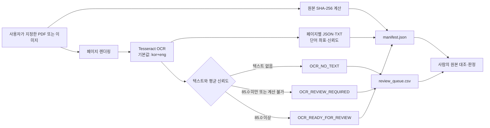

# Evidence OCR

> PDF와 스캔 이미지를 **원본 해시·페이지 이미지·OCR 결과·검토 큐가 연결된 증거 패키지**로 변환하는 로컬 우선 OCR 워크플로입니다.

[](https://github.com/mjjeon-minjea/codex-evidence-ocr)
[](https://www.python.org/)
[](#검증)
[](#지원-입력)
[](#ocr-분류와-판정-경계)
[](#라이선스)

## 핵심 원칙

> [!IMPORTANT]
> OCR 신뢰도는 **문자 인식 신호**일 뿐입니다. 규격 충족, 품질 합격, 문서 진위 또는 값의 정확성을 의미하지 않습니다. 모든 결과는 원본과 대조하는 사람의 검토를 거쳐야 합니다.

## 목차

- [프로젝트가 해결하는 문제](#프로젝트가-해결하는-문제)
- [주요 기능](#주요-기능)
- [처리 흐름](#처리-흐름)
- [빠른 시작](#빠른-시작)
- [CLI 사용법](#cli-사용법)
- [산출물과 출력 계약](#산출물과-출력-계약)
- [OCR 분류와 판정 경계](#ocr-분류와-판정-경계)
- [저장소 구조](#저장소-구조)
- [검증](#검증)
- [보안·개인정보 보호](#보안개인정보-보호)
- [현재 한계와 로드맵](#현재-한계와-로드맵)

## 프로젝트가 해결하는 문제

종이 기록이나 스캔본만 남아 있으면 필요한 내용을 다시 찾고, 출처를 확인하고, 이후 분석에 연결하는 데 반복적인 수작업이 필요합니다. 단순 OCR 텍스트만 저장하면 어느 원본과 페이지에서 나온 값인지 추적하기 어렵고, 잘못 인식된 값을 사실처럼 사용할 위험도 있습니다.

Evidence OCR은 원본을 변경하지 않고 다음 질문에 답할 수 있는 최소 증거 구조를 만듭니다.

| 질문 | 남기는 근거 |
|---|---|
| 어떤 파일을 처리했는가? | 원본 파일명과 SHA-256 |
| 어느 페이지에서 나온 결과인가? | 페이지 이미지와 페이지 번호 |
| OCR이 무엇을 인식했는가? | 페이지별 JSON·텍스트·단어 좌표 |
| 인식 상태가 불확실한가? | 평균 신뢰도와 검토 분류 |
| 사람이 먼저 확인할 페이지는 무엇인가? | `review_queue.csv` |
| 어떤 설정으로 처리했는가? | OCR 언어와 PDF 렌더링 DPI |

### 제공하는 것과 제공하지 않는 것

| 관점 | V0.1이 제공하는 것 | 제공하지 않는 것 |
|---|---|---|
| 증거 보존 | 원본 SHA-256과 페이지별 산출물 연결 | 원본 수정·대체·외부 업로드 |
| OCR 결과 | 텍스트, 단어 좌표, 단어별 신뢰도 | 완전한 표 구조·필드 의미 자동 복원 |
| 검토 지원 | 저신뢰도·무텍스트 페이지 분리 | OCR만으로 값 확정 또는 승인 |
| 데이터화 기반 | JSON·CSV 기반의 후속 구조화 준비 | 규격·합격·부적합 자동 판정 |
| 재현성 | 입력·언어·DPI·산출물 경로 기록 | 모델 학습, MES·SPC 자동 연동 |

## 주요 기능

- PDF를 지정한 DPI로 페이지별 PNG 이미지로 렌더링
- PNG, JPG, JPEG, TIF, TIFF 이미지를 단일 페이지 입력으로 처리
- Tesseract `image_to_data` 기반의 페이지별 OCR 수행
- 인식 단어별 텍스트·신뢰도·좌표·크기 기록
- 원본 파일의 SHA-256 계산
- 페이지별 OCR JSON과 일반 텍스트 생성
- 평균 신뢰도와 텍스트 유무를 이용한 검토 우선순위 분류
- 검토가 필요한 페이지만 `review_queue.csv`에 기록
- 입력·설정·페이지 산출물을 `manifest.json`으로 연결
- 기존 결과를 실수로 덮어쓰지 않도록 새 폴더 또는 빈 폴더만 허용

## 처리 흐름



## 빠른 시작

### 1. 필수 환경

- Python 3.11 이상 권장
- Tesseract OCR 실행 파일
- 사용할 OCR 언어 데이터
  - 기본값: 한국어 `kor` + 영어 `eng`

Tesseract가 설치되고 언어 데이터가 보이는지 먼저 확인합니다.

```powershell
tesseract --version
tesseract --list-langs
```

### 2. Python 환경 준비

```powershell
git clone https://github.com/mjjeon-minjea/codex-evidence-ocr.git
Set-Location .\codex-evidence-ocr

python -m venv .venv
.\.venv\Scripts\Activate.ps1
python -m pip install --upgrade pip
python -m pip install -r requirements.txt
```

### 3. 합성 샘플 생성

실제 문서 없이 설치 상태를 확인할 수 있도록 무해한 합성 이미지를 생성합니다.

```powershell
python samples/synthetic/generate_sample.py --output .\tmp\sample-record.png
```

### 4. OCR 실행

```powershell
python skills/evidence-ocr/scripts/process_document.py `
  .\tmp\sample-record.png `
  --output .\run\sample `
  --lang eng
```

성공하면 표준 출력에 처리 페이지 수와 검토 큐 수가 JSON으로 표시됩니다.

```json
{"pages": 1, "review_queue_count": 0}
```

> [!NOTE]
> 합성 샘플의 실제 분류는 설치된 Tesseract 버전, 글꼴 렌더링과 OCR 환경에 따라 달라질 수 있습니다. 분류값 자체보다 산출물이 생성되고 원본과 연결되는지를 확인하세요.

## CLI 사용법

```text
python skills/evidence-ocr/scripts/process_document.py INPUT \
  --output OUTPUT_DIR \
  [--dpi 250] \
  [--lang kor+eng]
```

| 인수 | 필수 | 기본값 | 설명 |
|---|---:|---:|---|
| `INPUT` | 예 | - | 처리할 PDF 또는 이미지 한 건 |
| `--output` | 예 | - | 새 폴더 또는 비어 있는 출력 폴더 |
| `--dpi` | 아니요 | `250` | PDF 렌더링 DPI, 허용 범위 `72–600` |
| `--lang` | 아니요 | `kor+eng` | Tesseract 언어 문자열 |

### 지원 입력

| 형식 | 확장자 | 페이지 처리 방식 |
|---|---|---|
| PDF | `.pdf` | 전체 페이지를 지정 DPI로 렌더링 |
| PNG | `.png` | 단일 페이지 이미지 |
| JPEG | `.jpg`, `.jpeg` | 단일 페이지 이미지 |
| TIFF | `.tif`, `.tiff` | 현재 V0.1에서는 단일 이미지로 처리 |

### 오류 처리

다음 조건에서는 오류 메시지를 표준 오류에 기록하고 종료 코드 `2`를 반환합니다.

- 입력 파일을 찾을 수 없음
- 지원하지 않는 파일 형식
- DPI가 `72–600` 범위를 벗어남
- 출력 폴더가 이미 존재하며 비어 있지 않음
- PyMuPDF, Pillow 또는 pytesseract가 설치되지 않음
- Tesseract 실행 파일을 찾을 수 없음

## 산출물과 출력 계약

한 번의 실행은 다음 구조를 생성합니다.

```text
run/sample/
├─ manifest.json
├─ review_queue.csv
├─ pages/
│  └─ page-0001.png
└─ ocr/
   ├─ page-0001.json
   └─ page-0001.txt
```

### `manifest.json`

입력과 모든 페이지 산출물을 연결하는 실행 단위의 정본입니다.

```json
{
  "schema_version": "1.0",
  "generated_at_utc": "2026-01-01T00:00:00+00:00",
  "input": {
    "filename": "sample-record.png",
    "sha256": "<64-character-sha256>"
  },
  "ocr": {
    "language": "eng",
    "dpi": 250
  },
  "pages": [
    {
      "page": 1,
      "image": "pages/page-0001.png",
      "ocr_json": "ocr/page-0001.json",
      "ocr_text": "ocr/page-0001.txt",
      "word_count": 12,
      "mean_confidence": 91.25,
      "classification": "OCR_READY_FOR_REVIEW"
    }
  ],
  "review_queue_count": 0
}
```

### 페이지별 OCR JSON

| 필드 | 의미 |
|---|---|
| `page` | 1부터 시작하는 페이지 번호 |
| `image` | 페이지 이미지 파일명 |
| `text` | 인식된 단어를 공백으로 연결한 텍스트 |
| `word_count` | 빈 문자열을 제외한 인식 단어 수 |
| `mean_confidence` | 유효한 단어 신뢰도의 산술평균, 없으면 `null` |
| `classification` | 페이지 검토 우선순위 분류 |
| `words[]` | 단어별 텍스트·신뢰도·좌표·크기 |

`words[]`의 좌표 필드는 `left`, `top`, `width`, `height`이며, 페이지 이미지 안에서 해당 단어의 위치를 나타냅니다.

### `review_queue.csv`

`OCR_NO_TEXT` 또는 `OCR_REVIEW_REQUIRED` 페이지와 검토 사유만 포함합니다. 승인 기록이나 수정 이력이 아니라 **후속 검토 목록**입니다.

상세 계약은 [`output-contract.md`](skills/evidence-ocr/references/output-contract.md)를 참고하세요.

## OCR 분류와 판정 경계

```text
텍스트 없음
  └─ OCR_NO_TEXT

텍스트 있음 + mean_confidence가 null 또는 85.0 미만
  └─ OCR_REVIEW_REQUIRED

텍스트 있음 + mean_confidence가 85.0 이상
  └─ OCR_READY_FOR_REVIEW
```

| 분류 | 의미 | 필요한 후속 행동 |
|---|---|---|
| `OCR_NO_TEXT` | 텍스트를 추출하지 못함 | 원본, 언어, 해상도와 OCR 영역 확인 |
| `OCR_REVIEW_REQUIRED` | 텍스트는 있으나 인식 신호가 기준 미달 | 원본 확대·재처리 또는 수동 확인 |
| `OCR_READY_FOR_REVIEW` | 사람의 검토를 시작할 OCR 신호 확보 | 원본과 문맥을 대조한 뒤 필요한 값만 확정 |

`OCR_READY_FOR_REVIEW`은 다음을 뜻하지 않습니다.

- 자동 승인
- 품질 합격
- 규격 충족
- 문서 진위 확인
- 측정값 정확성 보증

### 사람 검토 체크리스트

- 원본 파일의 SHA-256이 처리 대상과 일치하는가?
- 페이지 이미지와 OCR 페이지 번호가 일치하는가?
- 숫자, 소수점, 단위, 부호가 원본과 같은가?
- 표의 행·열 관계가 OCR 텍스트에서 뒤섞이지 않았는가?
- 검토 큐의 모든 페이지를 원본과 대조했는가?
- 확정한 값과 검토자·검토 시각은 별도 승인 기록에 남겼는가?

## 저장소 구조

```text
codex-evidence-ocr/
├─ README.md
├─ AGENTS.md
├─ MEMORY.md
├─ HANDOFF.md
├─ requirements.txt
├─ samples/
│  └─ synthetic/
│     ├─ README.md
│     └─ generate_sample.py
├─ skills/
│  └─ evidence-ocr/
│     ├─ SKILL.md
│     ├─ agents/
│     │  └─ openai.yaml
│     ├─ references/
│     │  └─ output-contract.md
│     └─ scripts/
│        └─ process_document.py
└─ tests/
   └─ test_process_document.py
```

### Codex 스킬로 재사용

다른 Codex 작업에서 이 저장소의 `skills/evidence-ocr/SKILL.md`를 읽고 다음 절차를 따릅니다.

1. 사용자가 입력 파일을 명시하고 로컬 처리를 승인했는지 확인
2. 원본은 저장소 밖에 보관
3. 매 실행마다 새 출력 폴더 사용
4. `output-contract.md`를 읽은 뒤 결과 해석
5. 모든 결과를 사람의 원본 검토 대상으로 취급

## 검증

### 단위시험

```powershell
python -m unittest discover -s tests -v
```

현재 시험은 OCR 분류 경계 세 가지를 확인합니다.

| 시험 | 기대 결과 |
|---|---|
| 텍스트 없음 | `OCR_NO_TEXT` |
| 신뢰도 `84.99` | `OCR_REVIEW_REQUIRED` |
| 신뢰도 `85.0` | `OCR_READY_FOR_REVIEW` |

### 공개 전 점검

- 실제 원본 PDF·이미지·스프레드시트가 Git 추적 대상에 없는지 확인
- `.env`, 키, 토큰, 인증서와 로컬 절대경로가 없는지 확인
- `input/`, `outputs/`, `run/`, `tmp/`, `work/`가 제외되는지 확인
- 단위시험 결과와 README의 검증 현황이 일치하는지 확인
- OCR 결과를 사실·승인·품질 판정으로 표현하지 않았는지 확인

## 보안·개인정보 보호

이 저장소는 공개 사용을 전제로 최소 코드와 합성 샘플만 보관합니다.

- 실제 회사 문서, 도면, 측정 기록, 작업자 정보와 로고를 커밋하지 않습니다.
- 원본과 실행 산출물은 저장소 밖의 승인된 로컬 작업 폴더에 보관합니다.
- `.gitignore`는 일반적인 원본·산출물 확장자와 작업 폴더를 제외합니다.
- 외부 업로드, 자동 발송, 모델 학습과 MES·SPC 연동은 V0.1 범위가 아닙니다.
- `manifest.json`의 원본 파일명도 민감정보를 포함할 수 있으므로 공개 전에 검토합니다.
- OCR 결과만으로 누락값을 추정하거나 판정을 자동 확정하지 않습니다.

## 현재 한계와 로드맵

### V0.1 한계

- 입력 한 건씩 처리
- 이미지 회전·기울기·노이즈 자동 보정 없음
- 손글씨·도장·서명 전용 인식 없음
- 표 구조와 의미 필드 자동 복원 없음
- 다중 페이지 TIFF 전용 분리 처리 없음
- OCR 결과 검토·수정 이력 UI 없음
- 실제 문서 기반 정확도 벤치마크 없음

### 확장 후보

- [ ] 회전·기울기·대비 전처리 프로파일
- [ ] 문서 유형별 OCR 설정 파일
- [ ] 표·좌표 기반 필드 후보 추출
- [ ] 사람이 확정한 값만 구조화 데이터로 내보내는 검토 단계
- [ ] 합성 샘플 기반 CLI 통합시험
- [ ] 처리 실행별 해시·설정·검토 결과 비교 리포트

확장 기능은 증거 추적성과 사람 승인 경계를 유지하는 범위에서만 추가합니다.

## 라이선스

아직 공개 라이선스를 선택하지 않았습니다. 따라서 외부 사용·수정·재배포 조건은 현재 명확히 허가되지 않은 상태입니다. 재사용 범위를 공개하려면 별도의 라이선스 결정이 필요합니다.

---

**Evidence OCR V0.1** — 인식 결과를 사실로 단정하지 않고, 원본과 연결된 검토 가능한 증거로 남깁니다.
